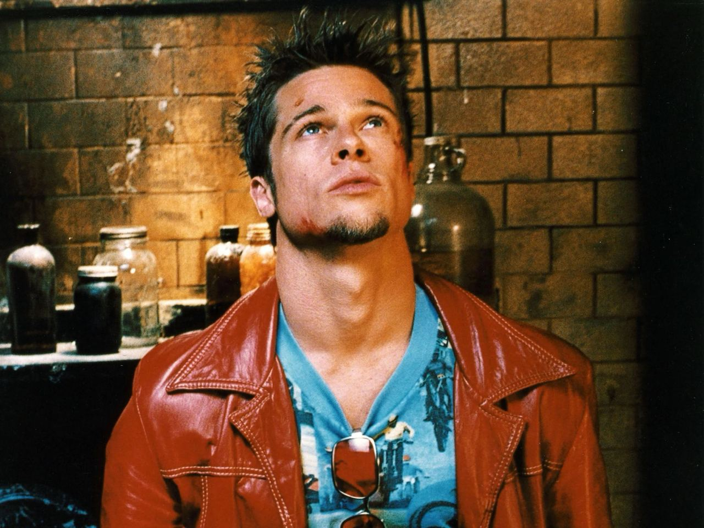
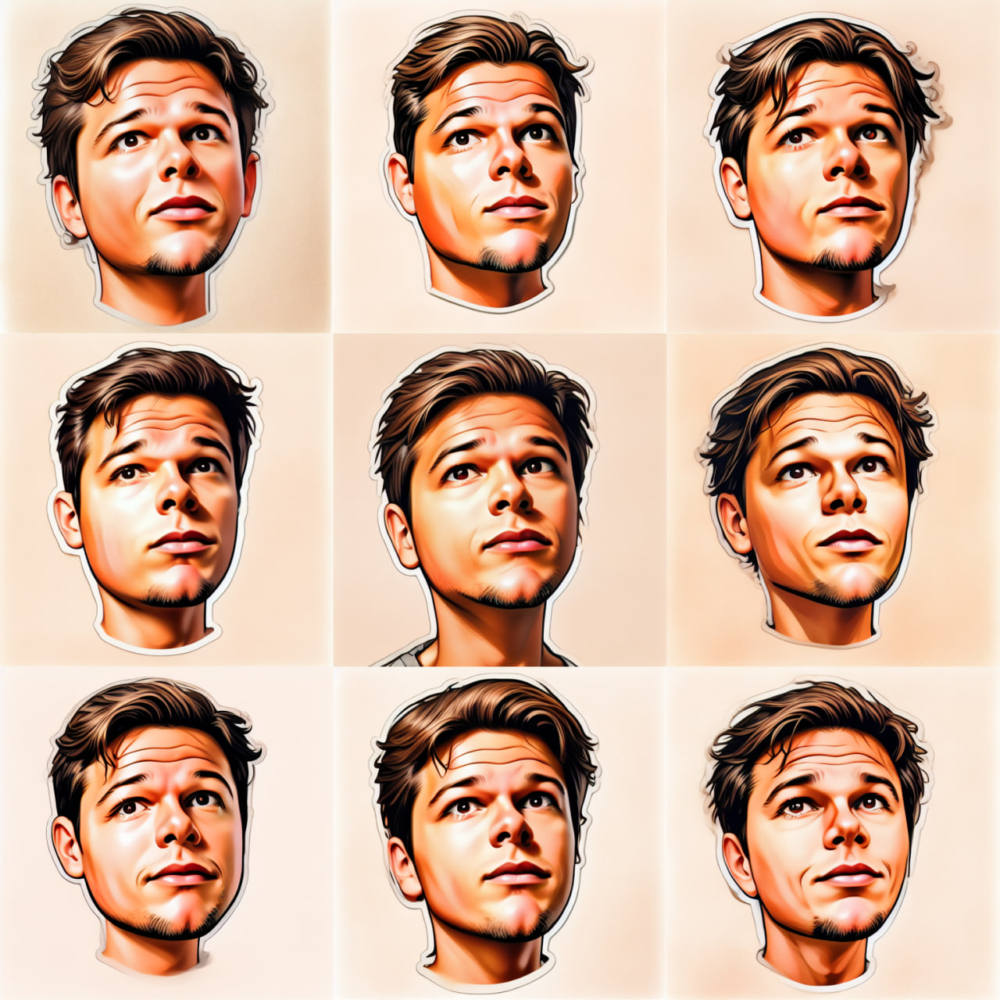

## Проект по обучению модели для генерации стикеров

### Обзор
Основная задача - обучение модели для трансформации изображений в стилизованные стикеры и добавление к ним анимаций.

### Датасеты

1. **Общий датасет объектов** ([Ссылка на Kaggle](https://www.kaggle.com/datasets/dmitrykutsenko/synthetic-stickers-dataset))
   - Исходные изображения различных объектов без лиц.
   - Пары изображений: оригинал и его стилизованная версия в виде стикера.
   - Работа с датасетом велась в течение 1.5-2 месяцев.
   - [Превью небольшой части датасета](https://huggingface.co/datasets/Alexator26/479_stickers_improved_v2)

2. **Датасет лиц**
   - Содержит пары изображений: фотографии лиц и соответствующие стикеры.
   - Разработка и очистка датасета заняли около 2 недель.
   - [Превью небольшой части датасета](https://huggingface.co/datasets/misshimichka/face_stickers_cleared)

### Ноутбуки и их функции

#### Для датасета объектов:

- `objects-data-collection/prompt-collecting-with-api.ipynb` - сбор промптов через API ChatGPT.
- `objects-data-collection/prompt-collecting.ipynb` - сбор промптов через парсинг диалогов с ChatGPT.
- `objects-data-collection/prompt-filtration.ipynb` - фильтрация промптов, удаление дубликатов.
- `objects-data-collection/synthetic-dataset-generation.ipynb` - генерация датасета с использованием базы данных Firebase.
- `objects-data-collection/calc_metrics.ipynb` - очистка датасета и расчет метрик.

#### Для датасета лиц:

- `faces-data-collection/generate-faces.ipynb` - генерация стикеров из фотографий лиц.
- `faces-data-collection/drop-similar.ipynb` - удаление похожих фотографий лиц.
- `faces-data-collection/faces-clean-notebook.ipynb` - очистка датасета и расчет метрик.

### Обучение модели

- `model-training/train_pix2pix.ipynb` - обучение модели pix2pix для трансформации лиц в стикеры.
- Процесс дообучения стилей, интеграция существующих стилей в базовую модель.

### Улучшение модели и визуализация результатов

- `utils/improved_inference.ipynb` - улучшения инференса модели.
- `animations/animate.ipynb` - создание анимаций стикеров.

### Визуальные примеры работы модели

**Исходное фото пользователя**  

**Стикер старой модели**  

**Сетка стикеров новой модели**  

### Внешние ресурсы

- [Датасет розовые волосы](https://huggingface.co/datasets/misshimichka/pink_hair_dataset_cleared)
- [Датасет цветы](https://huggingface.co/datasets/misshimichka/flower_faces_dataset_v3)
- [Датасет клоунское лицо](https://huggingface.co/datasets/misshimichka/clown_faces_dataset_cleared)
- [Датасет бабочек](https://huggingface.co/datasets/misshimichka/butterfly_faces_dataset_v1)
- [Датасет уши кошки](https://huggingface.co/datasets/misshimichka/cat_faces_dataset_cleared)

---

### Демо

Попробуйте нашего бота в Telegram для демонстрации возможностей генерации стикеров: [Telegram Bot](https://t.me/hse_project_test_bot)

